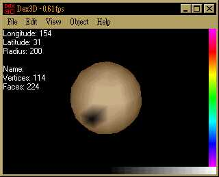



## Fantastic 3D Engine\!\!\!

### Description

It's very cool and advanced 3D engine made in pure VB WITHOUT any 3rd party components. It's not done by me, but I wanted to share it with you. It's name is Dex3d and made by Jerry J. Chen. So all credits are for him.
 
### More Info
 

             |
---                |---
**Submitted On**   |2000-01-23 14:21:20
**By**             |[bbence](https://github.com/Planet-Source-Code/PSCIndex/blob/master/ByAuthor/bbence.md)
**Level**          |Intermediate
**User Rating**    |5.0 (50 globes from 10 users)
**Compatibility**  |VB 5\.0, VB 6\.0
**Category**       |[Games](https://github.com/Planet-Source-Code/PSCIndex/blob/master/ByCategory/games__1-38.md)
**World**          |[Visual Basic](https://github.com/Planet-Source-Code/PSCIndex/blob/master/ByWorld/visual-basic.md)
**Archive File**   |[CODE\_UPLOAD36502272000\.zip](https://github.com/Planet-Source-Code/bbence-fantastic-3d-engine__1-6293/archive/master.zip)

